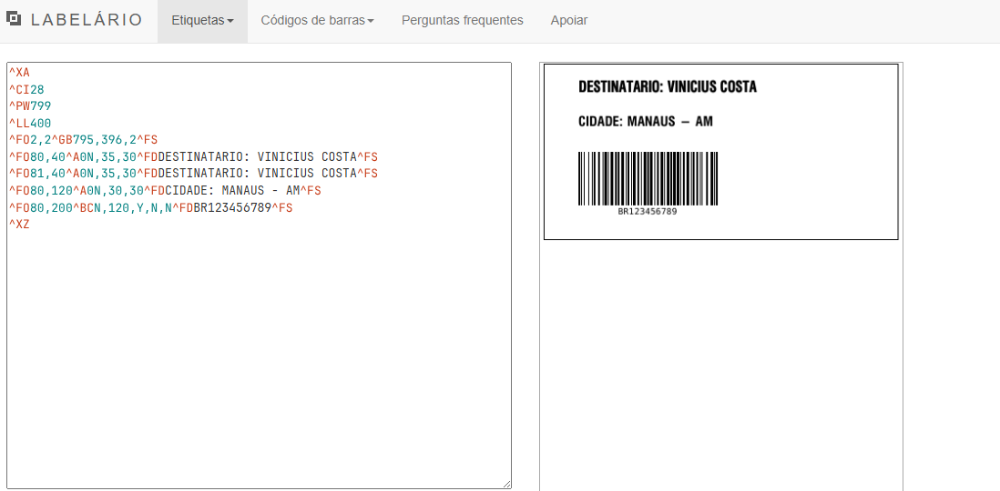

# 🏷️ Zebra ZPL SDK for Java (Enterprise Edition)


Uma SDK de alto desempenho para geração e gestão de etiquetas **ZPL II**, focada em automação industrial e logística. Este projeto abstrai a complexidade dos comandos Zebra, oferecendo uma interface fluente, segura e monitorada para operações críticas.

---

## 🚀 Diferenciais Técnicos

*   **Fluent API (mm to Dots):** Desenhe layouts em milímetros. O SDK cuida da conversão de escala automaticamente para 203, 300 ou 600 DPI.
*   **Auto-Fit Inteligente:** Algoritmo de ajuste dinâmico de fonte para garantir que textos variáveis nunca extrapolem os limites físicos da etiqueta.
*   **Fila Assíncrona (Thread-Safe):** Gerenciamento de impressão em background que garante a fluidez da aplicação principal.
*   **Monitoramento de Status:** Comunicação bidirecional via TCP/IP para detecção de erros em tempo real (Falta de papel, Ribbon, Cabeça aberta).
*   **Telemetria:** Geração automática de logs em CSV para auditoria de produção e rastreabilidade de falhas.

---

## 🔍 Validação e Preview Visual

O SDK permite validar o layout instantaneamente sem a necessidade de gastar suprimentos físicos, utilizando integração com o motor de renderização ZPL.

### Resultado Gerado:


> *Nota: A imagem acima é um exemplo real do output gerado pela biblioteca.*

---

## 💻 Exemplo de Implementação

```java
// 1. Construção do Template Fluente
ZplLabelBuilder builder = new ZplLabelBuilder(100, 50, 203)
    .withBorder()
    .text("PEDIDO: {{ID}}").at(10, 5).bold().end()
    .textAutoFit("CLIENTE: {{NOME}}", 80).at(10, 15).end()
    .barcode("{{TRACKING}}", 15).at(10, 30).end()
    .qrCode("[https://rastreio.com/](https://rastreio.com/){{TRACKING}}", 5).at(75, 10).end();

String zplTemplate = builder.build();

// 2. Validação Visual (Opcional)
ZplPreviewer.savePreview(zplTemplate, "images/exemplo-etiqueta.png");
